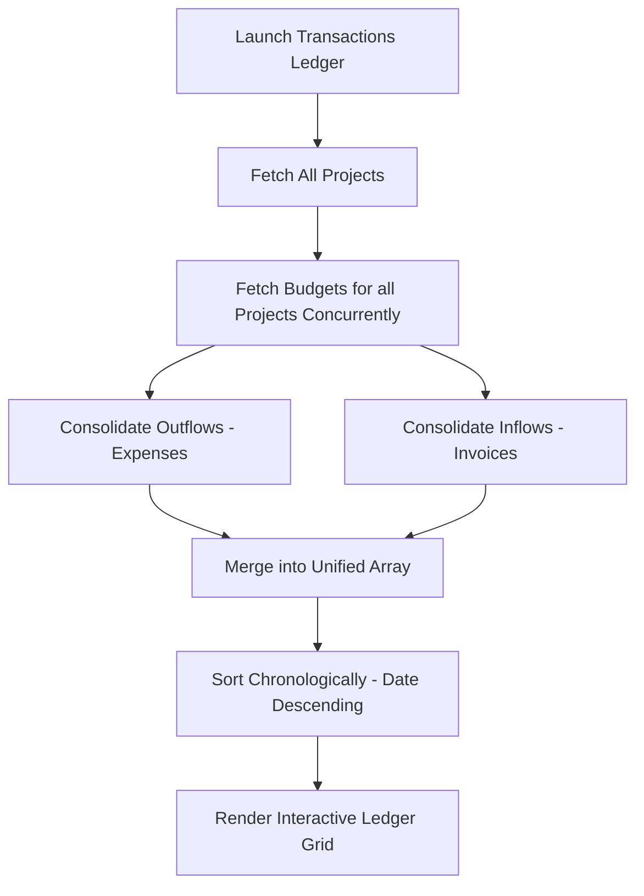

# Transactions Ledger Page Documentation (`Transactions.jsx`)

The **Financial Transactions Ledger** is a unified accounting audit segment of the Porchelvan Builders administrative portal. It aggregates operational project-based outflows (Expenses) and client-based inflows (Invoices) into a single centralized ledger, sorting records chronologically to provide deep, real-time insights into cashflow dynamics.

---

## 🎨 Page Interface Architecture
* **Consolidated Cashflow Metrics Segment (`.metrics-grid`)**: Real-time analytical dashboard cards featuring modern, harmonized color cards and subtle hover scale transforms:
  * **Total Inflow**: Aggregates all recorded invoices (`+₹amount`) across projects (themed in Indigo).
  * **Total Outflow**: Aggregates all logged materials, labor, or equipment expenses (`-₹amount`) (themed in Orange).
  * **Net Cash Position**: Computes `Inflow - Outflow`, dynamically adjusting colors (green for positive cash flow, red for debit positions) and rotating the trend indicator.
* **Granular Filter Toolbar (`.filters-card`)**:
  * **Search Ledger**: Deep text-matching on description, category, project site name, or currency amount.
  * **Construction Site Select**: Dynamically lists active projects to filter cashflows on a per-site basis.
  * **Transaction Type Select**: Toggles the display to show all entries, debit outflows, or credit inflows exclusively.
  * **Invoice Status Select**: Displays only Paid or Unpaid invoices.
* **Audit Grid Table (`.ledger-table`)**: Tabular, scrollable listing displaying dates, project sites, descriptions, category badges, inflow/outflow tags, signed cash amounts, and deep audit action triggers.
* **Ledger Detail Modal Overlay (`.transaction-detail-modal`)**: Renders a premium, clean digital receipt detailing dates, absolute timestamps, transaction IDs, site titles, descriptions, classification categories, and attachment statuses (for debit invoices).

---

## ⚙️ Consolidated Ledger Logic Flow

Because budget expenses and customer invoices are modularly associated with specific project documents, the Transactions module executes an advanced frontend consolidation sequence:

1. **Expense Model Alignment**: Converts raw project expenses to unified ledger entries:
   * `Type`: `Outflow`
   * `Amount`: `-₹` format
   * `Category`: Materials, Labor, Equipment, or Miscellaneous
2. **Invoice Model Alignment**: Converts raw project invoices to unified ledger entries:
   * `Type`: `Inflow`
   * `Amount`: `+₹` format
   * `Category`: Client Payment
   * `Status`: Paid or Unpaid

---

## 🔌 API Endpoints Integration

To retrieve and consolidate the ledger, the component orchestrates the following backend requests:

### 1. Active Projects Retrieval
* **GET `/api/projects`**
  * Fetches the array of active construction projects to map identifiers to clean human-readable site names.

### 2. Relational Cashflow Mapping
* **GET `/api/projects/:id/budget`**
  * Called concurrently for every project. Retrieves expenses and invoices arrays.
